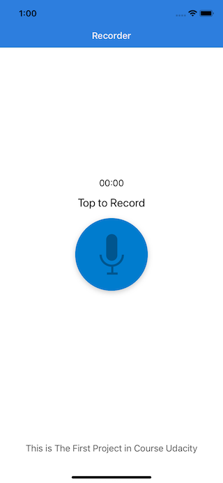
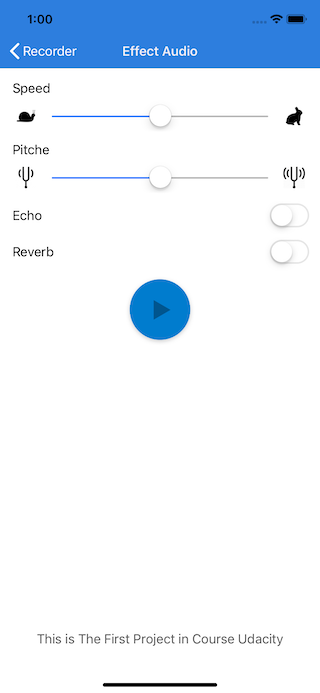

# YSSoundEffect
An iOS app created as part of my first project in the iOS Nanodegree program ( PitchPerfect )

---------------------------------------------------------------------------------------------
The Sound Effect app allows users to record a sound using the device's microphone. It then allows users to play the recorded sound back with effects.

## Compatibility
Swift 4

## Sound modulations
- Slider Slow And Fast Sound
- Slider Low And High Pitch
- add (Echo effect)
- add Reverb

## Problems?
Send me an [email](mailto:arabphone.sa@gmail.com) if you encounter any problems.

## Credits
Original graphical assets were provided by Udacity.
The concept for this app was presented during the iOS Nanodegree programme provided by Udacity.

## License
Freely provided under the MIT License.

